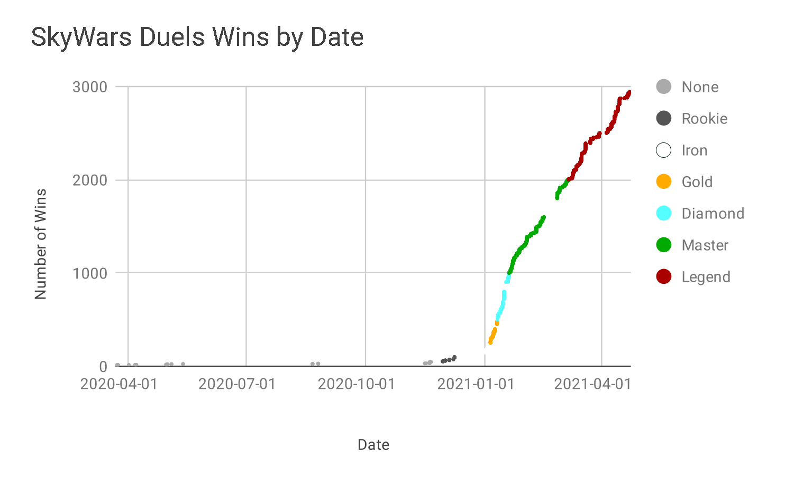
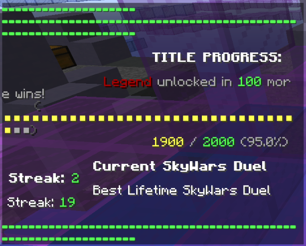

# Duels Wins by Date

I've spent a while recently working on tracking my Duels progress. I realized I could parse the Minecraft log files to get data on my Duels games, so I wrote a few Python scripts to do that. I then put it into Google Sheets to graph it below:



Maybe it's not interesting, or useful, but I guess it's sorta cool!

## Background Details

When you win a Duels game, a few seconds later Hypixel sends something like this to you through the chat:



It's entered into your client's log file, usually located in `C:\Users\[you]\AppData\Roaming\.minecraft\logs`. It looks like this:

```
[18:56:44] [Client thread/INFO]: [CHAT] ????????????????????????????????????????????????????????????????
[18:56:44] [Client thread/INFO]: [CHAT]                                         
[18:56:44] [Client thread/INFO]: [CHAT]                             TITLE PROGRESS:
[18:56:44] [Client thread/INFO]: [CHAT]
[18:56:44] [Client thread/INFO]: [CHAT]                  Legend III unlocked in 220 more wins!
[18:56:44] [Client thread/INFO]: [CHAT]       (??????????????????????????????????)
[18:56:44] [Client thread/INFO]: [CHAT]                             2981 / 3200 (93.2%)
[18:56:44] [Client thread/INFO]: [CHAT]
[18:56:44] [Client thread/INFO]: [CHAT]               Current SkyWars Doubles Streak: 1
[18:56:44] [Client thread/INFO]: [CHAT]                Best Lifetime SkyWars Doubles Streak: 14
[18:56:44] [Client thread/INFO]: [CHAT]
[18:56:44] [Client thread/INFO]: [CHAT] ????????????????????????????????????????????????????????????????
```

So my Python scripts just parse that, mostly using regex. You can take a look at the code here and try it yourself. You'll need to replace the file locations, and note the comments around line 37 of `parse_logs.py`.

Once you've generated the CSV file, you can import it into whatever software you want. I used Google Sheets and made a scatter plot chart. To get the coloring like I did, check this guide out: https://infoinspired.com/google-docs/spreadsheet/conditional-coloring-scatter-plot-in-google-sheets/

And check out my implementation in my Google Sheets sheet here: https://docs.google.com/spreadsheets/d/1eOyGE-l-3O5Sv02lNpYkDyCETvRZ8BDoh6B07uZgE9I/